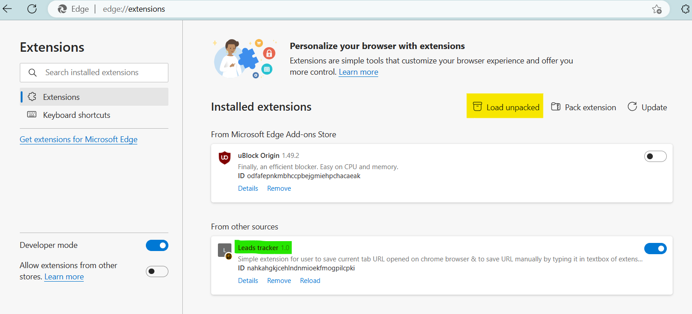

# Lead-Tracker
Lead Tracker is chrome extension built using HTML, CSS & Javascript. To save URL data within application <a href="https://www.javatpoint.com/javascript-localstorage" target="_blank">LocalStorage<a> is used. 

 Below is the overview on "Lead-Tracker" extension usage:
* User can use this extension to save URL opened in their current tab of chrome browser by clicking "SAVE TAB" button.
* User can also save their own URL by writing it inside text box of extension UI and clicking "SAVE INPUT" button.
* To delete saved URL, User can double click the "DELETE ALL" button to delete saved URL/s.

  
How to add extension in browser:
  
* Download Code/Clone Code from Git repo  (<a href="https://github.com/ujoshidev/Lead-Tracker">Lead-Tracker</a>)
* Open browser built on chromium (eg. Google Chrome/ Edge).
* Type "edge://extensions/" in search bar (without double quotes)
* Enable developer mode if not enabled
* After enabbling developer mode, Click on "Load Unpacked" button and select downloaded code folder.
* And there you have it, the extension should be added into your browser and in enables state.
   

Now user can browse to any website and use extrantion to save opened website URL.
  

